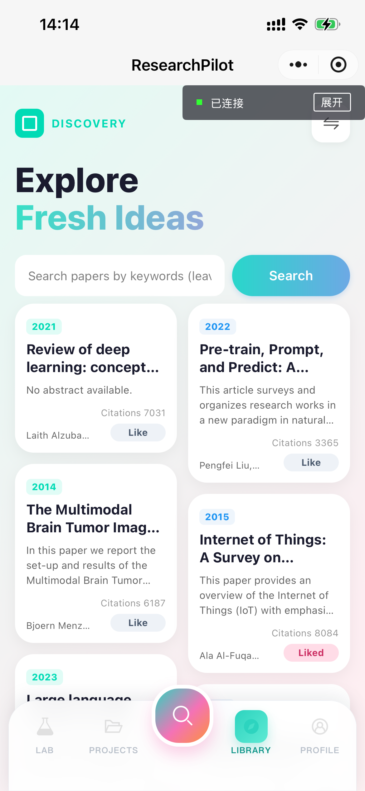
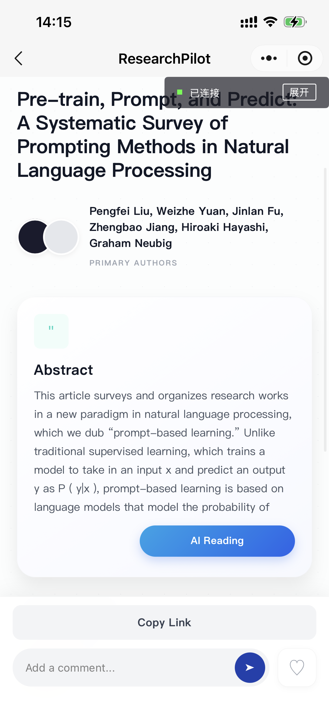
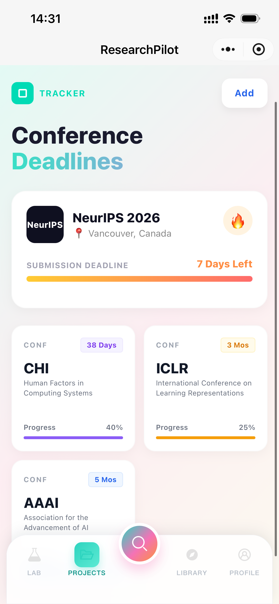
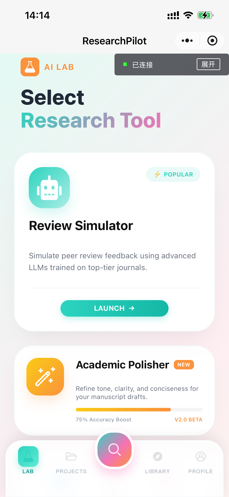
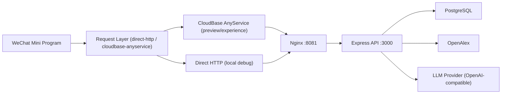

# Research Pilot

面向科研场景的微信小程序产品：把文献探索、论文阅读、AI 学术工具、投稿管理放到一个工作流里。

<p align="center">
  
</p>

## 为什么做这个产品

Research Pilot 聚焦研究生和科研初学者的高频动作：

1. 找文献：检索、筛选、收藏、标记阅读状态。
2. 读文献：快速查看摘要、评论互动、生成 AI Reading。
3. 写论文：AcademicPls 润色、Citations 引用格式化。
4. 做分析：DataViz 上传数据快速生成图表和洞察。
5. 管投稿：Projects 里管理会议卡片、截止日期与进度。

## 功能概览

| 模块 | 能力 |
|---|---|
| Auth | 微信登录、邮箱注册登录、JWT 鉴权 |
| Library | 论文流检索（OpenAlex）、收藏、阅读标记 |
| Paper Detail | 评论、评论点赞、AI 阅读摘要 |
| Projects | 会议卡片新增/编辑/删除、倒计时和进度 |
| Lab | AcademicPls / Citations / DataViz / Review Simulator |
| Profile | 收藏列表、语言偏好、徽章与个人资料 |

## 产品截图

| Library | Reading | Projects | Lab |
|---|---|---|---|
|  |  |  |  |

## 技术架构



## 当前代码结构

```text
ResearchPilot/
  miniprogram/      # 微信小程序前端
  backend/          # Node.js + Express 后端
  deploy/           # Docker Compose + Nginx
  docs/             # 项目文档与 wiki 草稿
  cloudfunctions/   # 云开发示例代码
```

## 快速开始

### 1) 启动后端（Docker）

```bash
cp deploy/.env.example deploy/.env
cd deploy
docker compose up -d --build
```

### 2) 健康检查

```bash
curl http://127.0.0.1:3005/healthz
curl http://127.0.0.1:8081/healthz
```

### 3) 配置小程序运行模式

编辑 `miniprogram/config/runtime.js`：

- 预览/体验推荐：
  - `apiMode: "cloudbase-anyservice"`
  - 配置 `cloudbase.env`
  - 配置 `anyServiceName` 或 `vmService`

- 本地调试可用：
  - `apiMode: "direct-http"`
  - `apiBaseUrl: "http://<ip>:<port>"`

## 核心配置项

后端环境变量位于 `deploy/.env`：

- `DATABASE_URL`
- `JWT_SECRET`
- `WECHAT_APP_ID` / `WECHAT_APP_SECRET`
- `OPENALEX_API_KEY`
- `LLM_API_KEY`
- `LLM_BASE_URL`
- `LLM_MODEL_POOL`
- `LLM_TIMEOUT_MS`
- `LLM_PER_MODEL_TIMEOUT_MS`
- `CITATION_LLM_TIMEOUT_MS`

## API 概览

- Auth：`/auth/wx-login`、`/auth/email-register`、`/auth/email-login`
- Users：`/users/me`、`/users/me/profile`、`/users/me/liked-papers`
- Papers：`/papers/feed`、`/papers/:id`、`/papers/:id/action`、`/papers/:id/like`
- Comments：`/papers/:id/comments`、`/papers/:id/comments/:commentId/like`
- Projects：`/projects/conferences`（GET/POST/PATCH/DELETE）
- Lab：
  - `/lab/academic-pls`
  - `/lab/citations/format`
  - `/lab/data-viz/tasks`
  - `/lab/review-simulator/tasks`

详细接口见：`docs/后端联调接口说明.md`

## 文档与 Wiki

- 架构说明：`docs/后端技术架构规划.md`
- AnyService 报告：`docs/CloudBase-AnyService-wiki.md`
- Wiki 草稿目录：`docs/wiki/`
