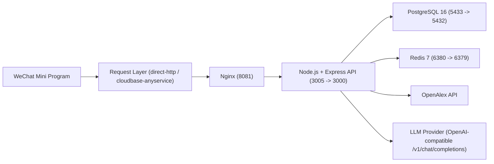

# Research Pilot

面向科研场景的微信小程序，提供文献探索、论文阅读、AI 学术工具与投稿进度管理能力。

<p align="center">
  
</p>

## 产品介绍

Research Pilot 聚焦研究生与科研初学者的高频任务，把“找文献、读文献、整理引用、润色文本、模拟审稿、跟踪会议截止日期”整合到一个小程序里。  
前端为微信小程序，后端为 Node.js API + PostgreSQL，支持通过 CloudBase AnyService 从小程序预览环境访问自建后端。

当前后端线上部署在云服务器 `111.229.204.242`，对外入口为：

- `http://111.229.204.242:8081`

## 功能模块

### 1) 账号与资料

- 微信登录（`/auth/wx-login`）+ 邮箱注册/登录（`/auth/email-register`、`/auth/email-login`）
- JWT 鉴权，统一 `Authorization: Bearer <token>`
- 微信首登资料完善（昵称、头像）
- 个人设置：语言偏好（中英）、徽章样式、头像昵称

### 2) 文献库（Library）

- 论文流检索与推荐（`/papers/feed`）
- 关键词搜索、瀑布流/卡片流浏览
- 收藏/取消收藏（`/papers/:id/like`）
- OpenAlex 拉取失败时自动回退本地缓存

### 3) 论文详情与互动

- 论文详情、作者、标签、引用数、跳转链接
- 阅读行为记录（`PASS | MARK | READ`）
- 评论发布、按时间/热度排序、评论点赞
- AI Reading：生成三行阅读摘要（LLM 不可用时自动降级为规则摘要）

### 4) Projects（投稿进度）

- 会议 Deadline 列表与倒计时
- 默认会议模板自动初始化（首次登录）
- 会议条目增删改（简称、全称、日期、进度、主题色、备注）

### 5) Lab（AI 工具）

- `Academic PLS`：学术文本润色
- `Citations`：参考文献格式化（APA7 / MLA9 / Chicago / Auto）
- `DataViz`：上传 CSV/JSON/XLS/XLSX，异步生成图表与洞察
- `Review Simulator`：上传 PDF/TXT/MD，异步生成审稿意见（结论、评分、优劣势、建议）
- 各工具支持 Recent 历史记录（查询/删除）

## 技术架构



### 前端（`miniprogram/`）

- 微信小程序原生框架
- 自定义 TabBar 与统一请求层（`miniprogram/utils/request.js`）
- 运行时双通道：
  - `direct-http`：本地/直连调试
  - `cloudbase-anyservice`：小程序预览/体验版推荐

### 后端（`backend/`）

- Node.js + Express
- PostgreSQL 读写（用户、论文、评论、点赞、项目截止时间、Lab 历史记录）
- JWT 鉴权 + 微信 `code2session`
- AI 能力统一走模型池与超时/回退策略
- `Review Simulator`、`DataViz` 使用异步任务（内存 Map + TTL）

### 部署（`deploy/`）

- Docker Compose 编排：`nginx`、`api`、`postgres`、`redis`
- Nginx 反向代理 + 健康检查
- API/DB/Redis 仅绑定本机回环，公网仅开放 Nginx 入口

## 项目结构

```text
ResearchPilot/
  miniprogram/         # 微信小程序前端
  backend/             # Node.js API 服务
  deploy/              # Docker Compose 与 Nginx 配置
  docs/                # 架构、联调、落地文档
  cloudfunctions/      # 云开发示例/扩展代码
```

## 关键接口分组

- 认证：`/auth/*`
- 用户：`/users/me`、`/users/me/profile`、`/users/me/liked-papers`
- 论文：`/papers/feed`、`/papers/:id`、`/papers/:id/action`、`/papers/:id/like`
- 评论：`/papers/:id/comments`、`/papers/:id/comments/:commentId/like`
- 个人中心：`/profile/dashboard`
- Lab：
  - `Academic PLS`：`/lab/academic-pls`
  - `Citations`：`/lab/citations/format`
  - `DataViz`：`/lab/data-viz/tasks`（异步）
  - `Review Simulator`：`/lab/review-simulator/tasks`（异步）

## 快速启动

### 1) 后端服务启动

```bash
cp deploy/.env.example deploy/.env
cd deploy
docker compose up -d --build
```

### 2) 健康检查

```bash
curl http://127.0.0.1:3005/healthz
curl http://127.0.0.1:8081/healthz
```

### 3) 小程序运行配置

编辑 `miniprogram/config/runtime.js`：

- AnyService（推荐）：
  - `apiMode: "cloudbase-anyservice"`
  - `cloudbase.env`
  - `cloudbase.anyServiceName` 或 `cloudbase.vmService` 二选一
- 直连调试：
  - `apiMode: "direct-http"`
  - `apiBaseUrl: "http://111.229.204.242:8081"`

## 线上部署现状（2026-02-27 已核对）

已通过 SSH 登录 `root@111.229.204.242` 核对（部署目录：`/opt/research-pilot`）：

- 运行容器：
  - `rp-nginx`（`0.0.0.0:8081->80`）
  - `rp-api`（`127.0.0.1:3005->3000`）
  - `rp-postgres`（`127.0.0.1:5433->5432`）
  - `rp-redis`（`127.0.0.1:6380->6379`）
- 健康检查：
  - `http://127.0.0.1:3005/healthz` 返回 `status: ok`
  - `http://127.0.0.1:8081/healthz` 返回 `status: ok`

## 核心环境变量

- `DATABASE_URL`：PostgreSQL 连接串
- `JWT_SECRET`：JWT 签名密钥
- `WECHAT_APP_ID`、`WECHAT_APP_SECRET`：微信登录凭据
- `LLM_API_KEY`、`LLM_BASE_URL`、`LLM_MODEL_POOL`
- `OPENALEX_API_KEY`（可选）
- `DEFAULT_FEED_KEYWORDS`
- `CITATION_LLM_TIMEOUT_MS`、`LLM_TIMEOUT_MS`、`LLM_PER_MODEL_TIMEOUT_MS`

## 常见问题

- 预览环境可打开但接口失败：检查 `runtime.js` 的 AnyService 配置是否完整
- AnyService 长请求超时：使用异步任务接口（DataViz、Review Simulator）
- 微信登录后反复要求完善资料：检查数据库中昵称/头像是否成功写入

## 相关文档

- `docs/后端联调接口说明.md`
- `docs/后端技术架构规划.md`
- `docs/CloudBase-AnyService落地指南.md`
