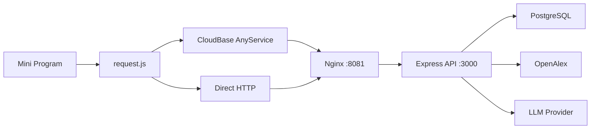

# 系统架构

## 总览

## 前端层

- 运行时模式切换：`direct-http` / `cloudbase-anyservice`
- 统一请求封装：`miniprogram/utils/request.js`
- 自定义 TabBar 与全局搜索预取

## 后端层

- 单体 API 入口：`backend/src/index.js`
- 模块方向：auth / users / papers / projects / lab / profile
- LLM 调用策略：按模型池串行重试

## 数据层

- PostgreSQL 为主存储
- Redis 已部署（当前任务状态仍以内存 Map 为主）

## 异步能力

- DataViz 和 Review Simulator 使用创建任务 + 轮询模式
