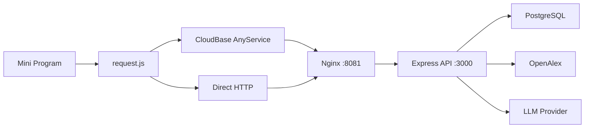

# 系统架构

## 全链路视图

## 前端层

| 能力 | 说明 |
| --- | --- |
| 运行时模式切换 | `direct-http` / `cloudbase-anyservice` |
| 请求统一封装 | `miniprogram/utils/request.js` |
| 页面能力 | 自定义 TabBar、全局搜索预取 |

前端详细实现见：[前端实现说明](Frontend-Implementation)。

## 后端层

| 项目 | 说明 |
| --- | --- |
| API 入口 | `backend/src/index.js` |
| 业务模块 | `auth / users / papers / projects / lab / profile` |
| LLM 策略 | 模型池按优先级串行重试，命中即返回 |

## 数据层

- 主存储：PostgreSQL。
- Redis 已部署，但当前任务状态仍以内存 Map 为主（重启会丢失运行态任务）。

## 异步任务模型

- DataViz：`创建任务 -> 轮询状态 -> 拉取结果`
- Review Simulator：`创建任务 -> 轮询状态 -> 拉取结果`

## 相关页面

- 前端细节见 [前端实现说明](Frontend-Implementation)
- 接口清单见 [后端 API 参考](API-Reference)
- 运维命令见 [部署与运维](Deployment-and-Ops)
- 常见异常见 [故障排查](Troubleshooting)
